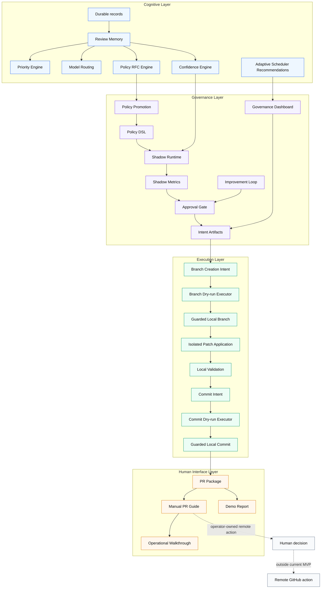

# Architecture

ClawSweeper Operant Lab is a governed autonomous engineering runtime.

It is not an agent that acts first. It prepares, constrains, simulates, validates, and explains action before humans authorize remote consequences.

## Four-Layer Model

```text
Cognitive Layer
-> Governance Layer
-> Execution Layer
-> Human Interface Layer
```



## Operating Doctrine

```text
The system prepares;
the operator decides.
```

The lab is designed to make AI-prepared software changes observable, reviewable, reversible, and bounded.

## Artifact Flow

```text
Evidence
-> Proposal
-> Approval
-> Simulation
-> Intent
-> Governance
-> Guarded Branch
-> Isolated Apply
-> Local Validation
-> Commit Intent
-> Commit Preview
-> Guarded Commit
-> PR Package
-> Manual PR Guide
```

## Boundary

The architecture deliberately stops before unattended remote action.

Current MVP:

- local governed execution
- human-ready remote guidance
- no GitHub mutation
- no push
- no PR creation
- no merge

Future remote governance must preserve the same staged contract:

```text
Manual PR Guide
-> Remote Action Intent
-> Remote Action Dry-run
-> Operator Approval
-> Guarded Remote Action
```
