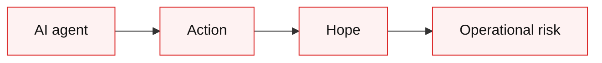
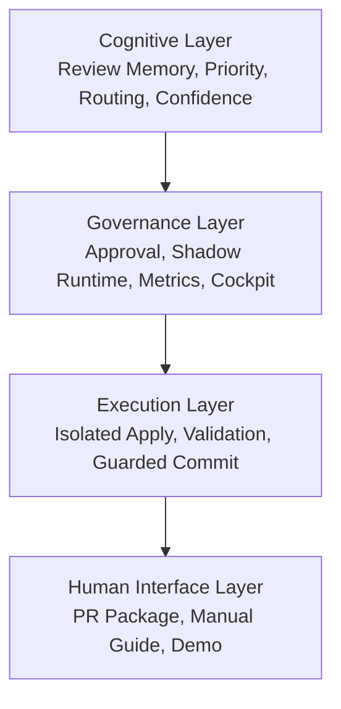
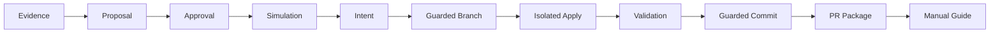

# Visual Flow Asset

This file contains Markdown-ready visual blocks for demos, slides, and landing pages.

## Bad Default AI Agent Loop



Caption:

```text
agent -> action -> hope
```

## Governed Operant Loop

```mermaid
flowchart LR
  Evidence["Evidence"] --> Proposal["Proposal"]
  Proposal --> Approval["Approval"]
  Approval --> Simulation["Simulation"]
  Simulation --> Intent["Intent"]
  Intent --> Constrained["Constrained local action"]
  Constrained --> Explain["Explain"]
  Explain --> Human["Human authorization"]

  classDef safe fill:#ecfdf5,stroke:#059669,color:#111;
  classDef govern fill:#f5f3ff,stroke:#7c3aed,color:#111;
  classDef human fill:#fff7ed,stroke:#d97706,color:#111;

  class Evidence,Proposal govern;
  class Approval,Simulation,Intent govern;
  class Constrained,Explain safe;
  class Human human;
```



Caption:

```text
evidence -> approval -> simulation -> constrained action
```

## Four Layers



## Local Governed Execution MVP



## Safety Panel

```text
Safety guarantees

- default dry-run
- explicit execute gates
- isolated execution
- deterministic artifacts
- rollback generation
- operator-owned remote action
- no hidden mutation
```

## Intentionally Not Automated Panel

```text
Intentionally not automated

- autonomous merge
- unattended remote mutation
- hidden GitHub actions
- self-modifying execution policy
- remote PR creation in the current MVP
```
