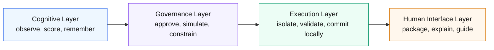

# Visual Walkthrough

Goal:

```text
make the doctrine visually understandable in 60 seconds
```

## One-Screen Message

Category:

```text
Governed AI software operations.
```

Philosophy:

```text
The system prepares; the operator decides.
```

Differential:

```text
not more autonomy;
more operational legibility.
```

Core claim:

```text
This is not an agent that acts first.
This is a governed runtime that prepares, constrains, simulates, validates, and explains action before humans authorize remote consequences.
```

## The Problem

Most AI agent demos imply this flow:

```text
agent -> action -> hope
```

That is operationally fragile because action arrives before enough explanation, approval, rollback, or review.

Operant Lab uses:

```text
evidence -> approval -> simulation -> constrained action
```

The product value is not simply more automation. It is autonomy made legible, reviewable, and bounded.

## Four-Layer Architecture



## Local Governed Execution MVP

```mermaid
flowchart LR
  Evidence["Evidence"] --> Proposal["Proposal"]
  Proposal --> Approval["Approval"]
  Approval --> Simulation["Simulation"]
  Simulation --> Intent["Intent"]
  Intent --> Guarded["Guarded Execution"]
  Guarded --> Validation["Validation"]
  Validation --> Package["PR Package"]
  Package --> Guide["Manual Guide"]

  Guide -. "operator-owned" .-> Remote["Remote action"]
```



Readable version:

```text
Evidence
-> Proposal
-> Approval
-> Simulation
-> Intent
-> Guarded Execution
-> Validation
-> PR Package
-> Manual Guide
```

## Safety Guarantees

- default dry-run
- explicit execution gates
- isolated execution
- deterministic artifacts
- rollback generation
- operator-owned remote action
- no hidden mutation

## Intentionally Not Automated

- no autonomous merge
- no unattended remote mutation
- no hidden GitHub actions
- no self-modifying execution policy
- no remote PR creation in the current MVP
- no production deployment automation

## 60-Second Demo Script

0-10 seconds:

```text
Most AI agents act first and explain later. Operant Lab reverses that.
```

10-20 seconds:

```text
It starts with evidence: durable records, memory, risk, confidence, and repeated operational patterns.
```

20-35 seconds:

```text
Evidence becomes proposals, approvals, simulations, and constrained intents before any local action.
```

35-50 seconds:

```text
Local action happens only inside guardrails: isolated patch application, allowlisted validation, and guarded local commit.
```

50-60 seconds:

```text
The output is not blind automation. It is a PR package and manual guide so the operator owns remote consequences.
```

Closing line:

```text
The system prepares; the operator decides.
```
